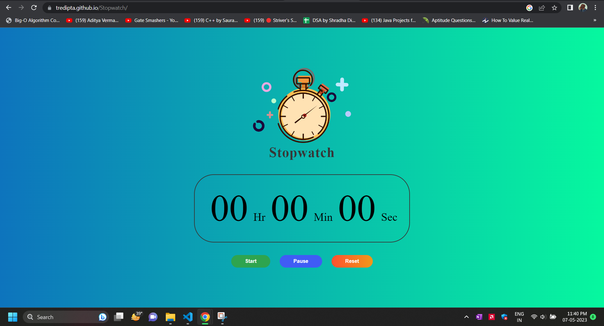

# STOPWATCH 
STOPWATCH By Tredipta Mondal

# STOPWATCH using Vanilla JavaScript

<li>This is a repository for STOPWATCH Developed using Vanilla JavaScript, HTML, CSS.</li>
 
<li> It is developed to create a soothing Experience with powerful features and clean interface.</li>
 

#About Project
/--------------------------------------------------------/

1. Create an HTML file with the required markup for the stopwatch display and control buttons.

2. Create a CSS file to style the stopwatch display and control buttons.

3. In the JavaScript file, create variables for the display elements and control buttons.

4. Create variables to hold the start time of the stopwatch and the interval ID returned by `setInterval()`.

5. Add event listeners to start, stop, and reset the stopwatch when the control buttons are clicked.

6. In the start event listener, get the current time and assign it to the start time variable. Then, use `setInterval()` to call a function that updates the display every 10 milliseconds.

7. In the update function, get the current time again and calculate the elapsed time by subtracting the start time from the current time. Then, update the display with the elapsed time.

8. In the stop event listener, clear the interval using the interval ID.

9. In the reset event listener, clear the interval using the interval ID, reset the start time variable, and update the display to show "00:00:00".

# Problem Statement

Create a stopwatch. Use ONLY vanilla javascript, no libraries or frameworks allowed for Javascript (you can use any css framework like Bootstrap).

 
/-------------------------------------------------------------------------------------------------------------------------------------------------/

# CODE PROCESS
/---------------------------------------------/

1.Create a variable to hold the start time of the stopwatch.

2.Use the Date object to get the current time and assign it to the start time variable.

3.Create a variable to hold the interval ID returned by setInterval().

4.In the interval function, get the current time again and calculate the elapsed time by subtracting the start time from the current time.

5.Update the display of the elapsed time.

6.Add event listeners to start, stop, and reset the stopwatch.

7.When the stopwatch is stopped or reset, clear the interval using the interval ID.

/--------------------------------------------------------------------------------------------------------------------------------------/

# PRODUCT DEMO

![Stopwatch]    

# LINKS

<a href = "https://tredipta.github.io/Stopwatch/"> <b>LIVE PRODUCT</b> </a>  &nbsp; <a href = "https://github.com/tredipta/Stopwatch"> <b>CODE</b> </a>  

--------------------------------------------------------------------------------------------------------------------------------------------------------
 
<strong>Connect With Me @</strong>

